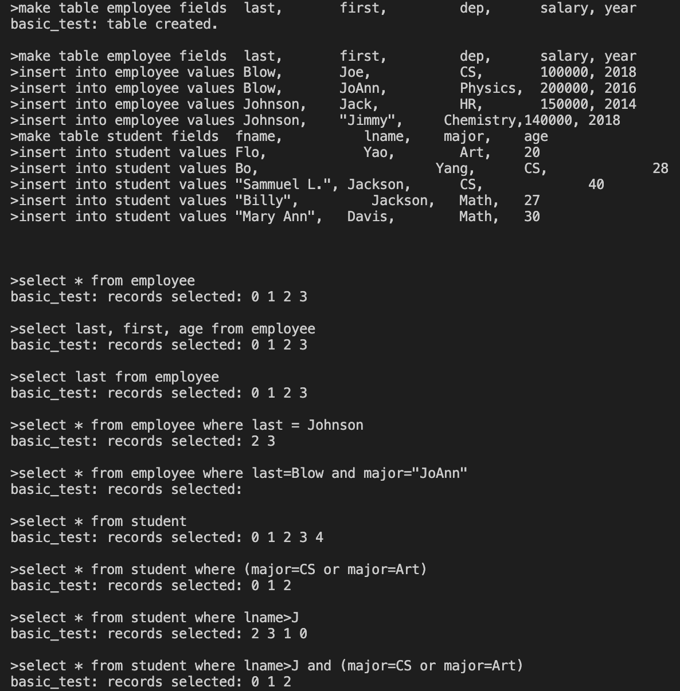

# Work Report

## Name: <ins>Yucheng Zhao</ins>

## Features:

- Not Implemented:
  - UPDATE, DELETE, DROP TABLE
  - ORDER BY, LIMIT, JOIN
  - Persistent storage (save/load tables)
  - Indexes for faster filtering on large tables
  - More advanced error handling and type checking

<br><br>

- Implemented:
  - CREATE TABLE (using `MAKE TABLE ... FIELDS ...`)
  - INSERT INTO table with values
  - SELECT with specific fields or `*`
  - WHERE clause with conditions (`=`, `!=`, `>`, `<`)
  - Boolean logic in WHERE (`AND`, `OR`, parentheses)
  - Support for both strings and numbers
  - Output of matching record indices and rows

<br><br>

## Example Usage:

```sql
MAKE TABLE employee FIELDS last, first, dep, salary, year;
INSERT INTO employee VALUES Blow, Joe, CS, 100000, 2018;
INSERT INTO employee VALUES Blow, JoAnn, Physics, 200000, 2016;
INSERT INTO employee VALUES Johnson, Jack, HR, 150000, 2014;
INSERT INTO employee VALUES Johnson, "Jimmy", Chemistry, 140000, 2018;

SELECT * FROM employee;
SELECT last, first FROM employee;
SELECT * FROM employee WHERE last = Johnson;

```

